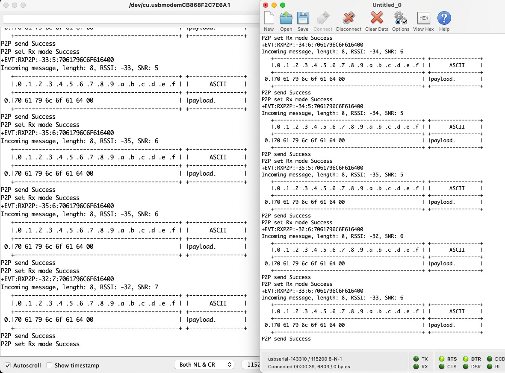
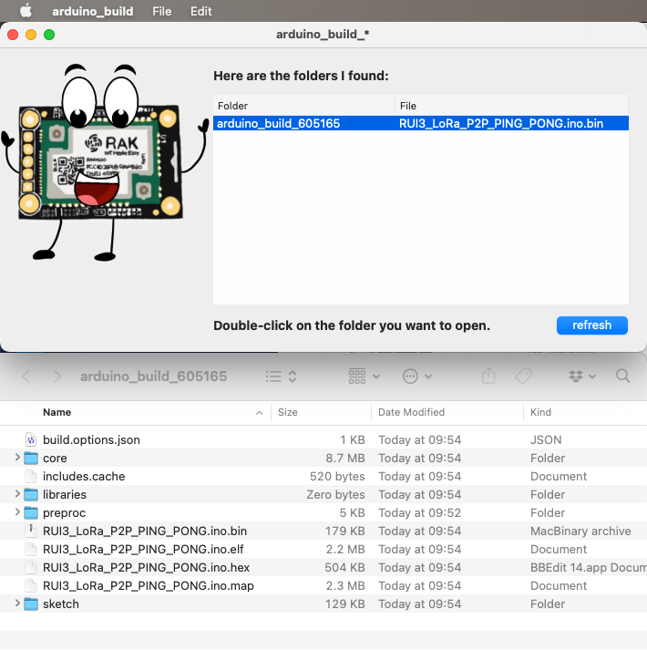

# RUI3_LoRa_P2P_PING_PONG

Sample code for our new platform RUI3, which provides a unified API for our MCUs, starting with RAK4631 and RAK3172. *Hello World* in LoRa is the classic PING PONG, where LoRa packets are exchanged, usually between 2 modules. Three's a crowd as they say, and require a little more work (doesn't it always?)

In order to compile on RAK4631, a simple cmd-U / ctrl-U is enough (assuming you installed the RUI3 BSP, natch). On RAK3172, it being an STM32 MCU, things are of course more complicated. You need to use STM32Cube Programmer, and pick up the hex file from the temporary folder Arduino uses for compiling cleanly. It appears in the Arduino IDE logs as:

`/Users/xxx/Library/Arduino15/packages/rak_rui/tools/arm-none-eabi-gcc/9-2019q4/bin/arm-none-eabi-size -A /var/folders/fg/nc6_868939q81qjxzv5g371w0000gn/T/arduino_build_605165/RUI3_LoRa_P2P_PING_PONG.ino.elf`

The `/var/folders/fg/nc6_868939q81qjxzv5g371w0000gn/T/arduino_build_605165/` (name will be different) is what you need. Copy that and in the Terminal type `open ` and paste that path. Type enter and this appears in the Finder. I wrote a tool do do this for you, `arduino_build`, which does it for you. This will be made available shortly.

